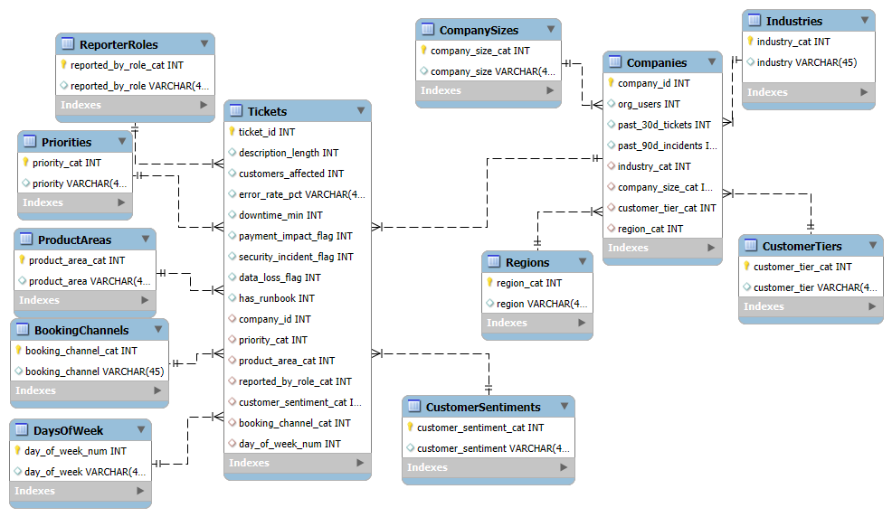

Support Ticket System Database Design

This project features a robust, **3NF (Third Normal Form) normalized** MySQL database schema designed to streamline technical support processes and incident management.

🚀 Overview
The system is built to handle high-volume support requests, ensuring data integrity and efficient querying for incident history, customer relationships, and agent performance.

🛠 Technical Highlights
- **Architecture:** Relational Database Model (RDBMS).
- **Normalization:** Fully compliant with **3NF** to eliminate data redundancy.
- **Key Features:**
  - Automated incident tracking.
  - Historical data analysis (e.g., `past_90d_incident` logic).
  - Categorized ticket priority levels.

📊 Entity Relationship (ER) Diagram

*Visual representation of the database schema and table relationships.*

## 📁 Repository Structure
- `/sql`: Contains the full `support_ticket_db.sql` dump.
- `/diagrams`: High-resolution ER modeling diagrams.

## 💻 Sample Query
To find high-priority incidents from the last 90 days:
```sql
SELECT ticket_id, subject, priority 
FROM tickets 
WHERE status = 'Open' 
AND created_at >= DATE_SUB(NOW(), INTERVAL 90 DAY) 
ORDER BY priority DESC;
